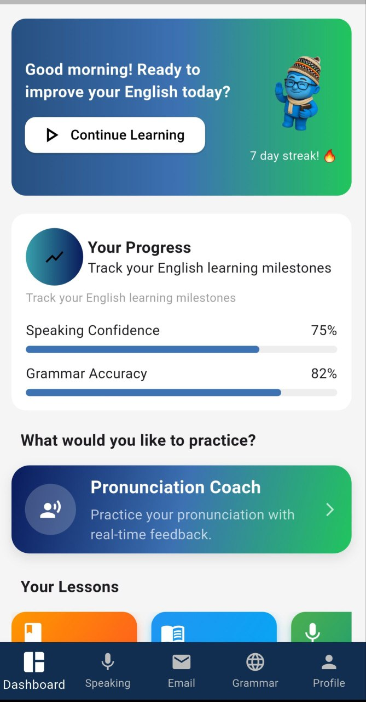
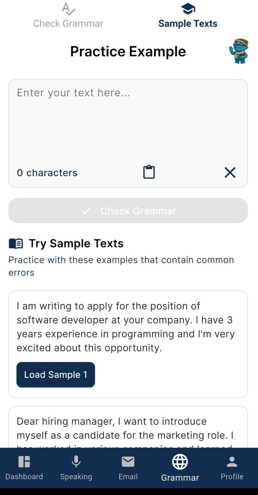
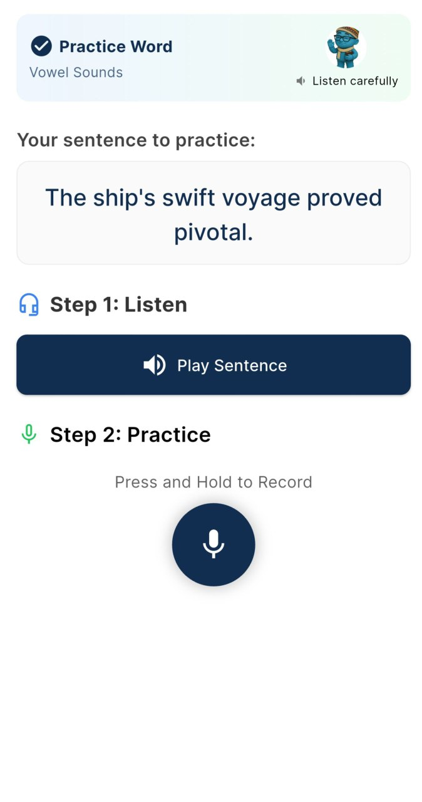
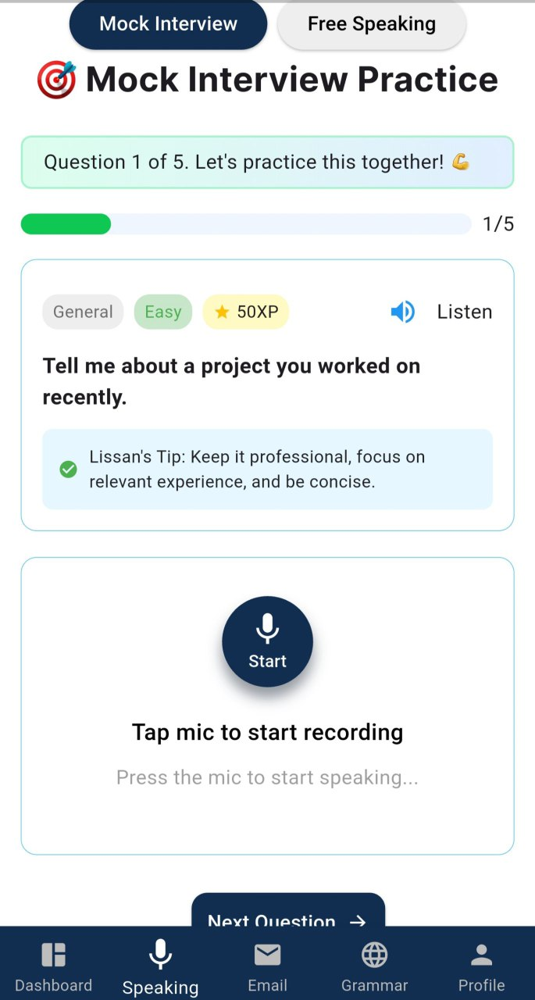
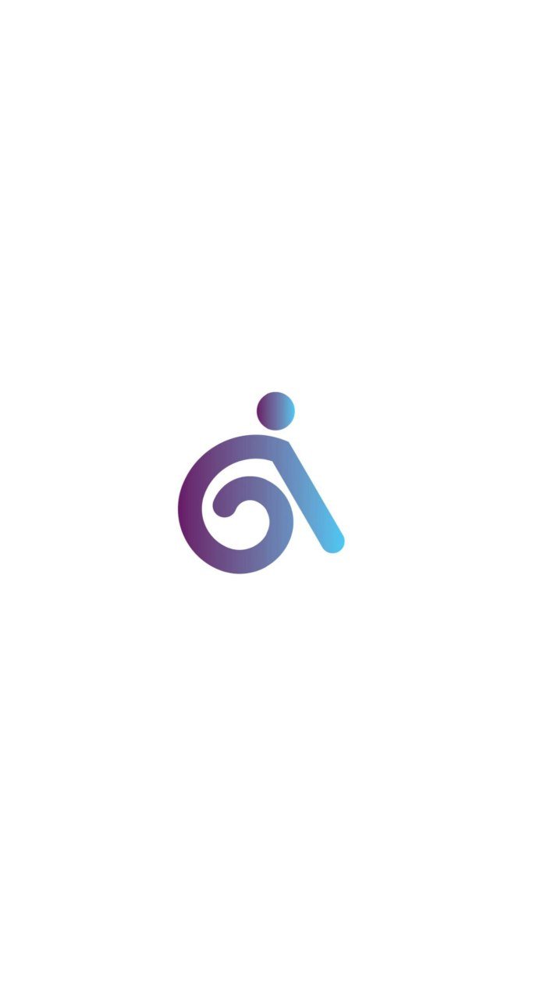
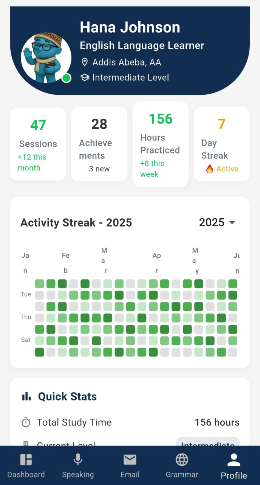

# 📱 Lissan AI  

Lissan AI is a Flutter-based mobile application designed to [briefly describe purpose — e.g., “help users improve writing through AI-powered grammar checking and text enhancement”].  
This project is built using **Flutter** to deliver a smooth, cross-platform experience on both Android and iOS.  

---

## 🚀 Features  
- AI-powered text analysis and grammar checking  
- Clean and intuitive user interface  
- Cross-platform (Android & iOS) support  
- [Add more features as your project grows]  

---

## 📸 Screenshots  

### Dashboard  








## 🛠️ Tech Stack  
- **Flutter** (Dart)  
- **State Management**: [e.g., Riverpod / Bloc / Provider]  
- **Backend / API**: [e.g., Firebase / REST API / GraphQL]  
- **Version Control**: Git & GitHub  

---

## 📂 Project Setup  

1. Clone the repository:  
   ```bash
   git clone https://github.com/yaftes/lissan-ai-mobile
   cd lissan-ai-mobile
